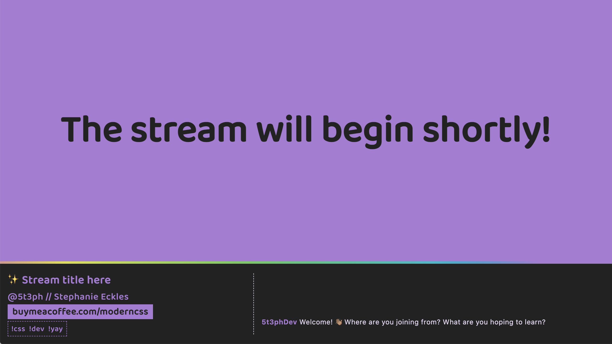
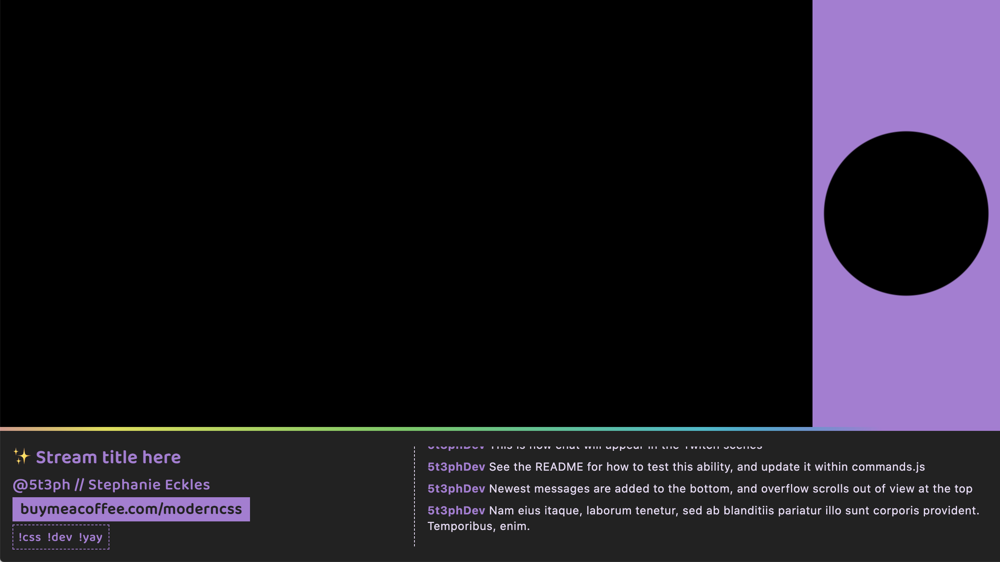
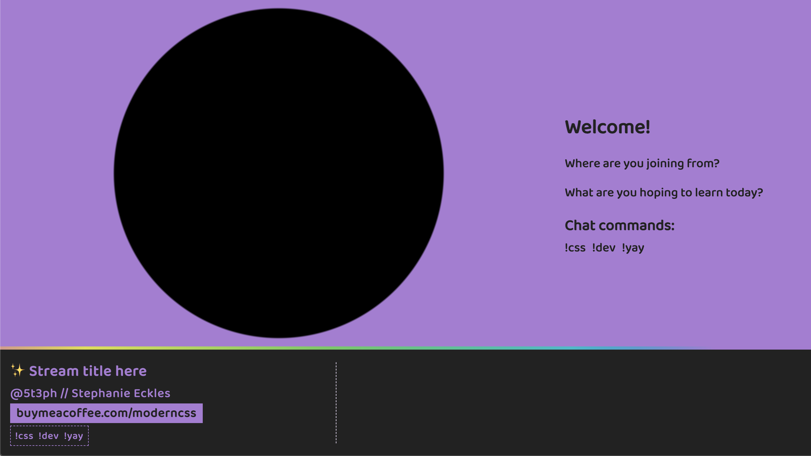
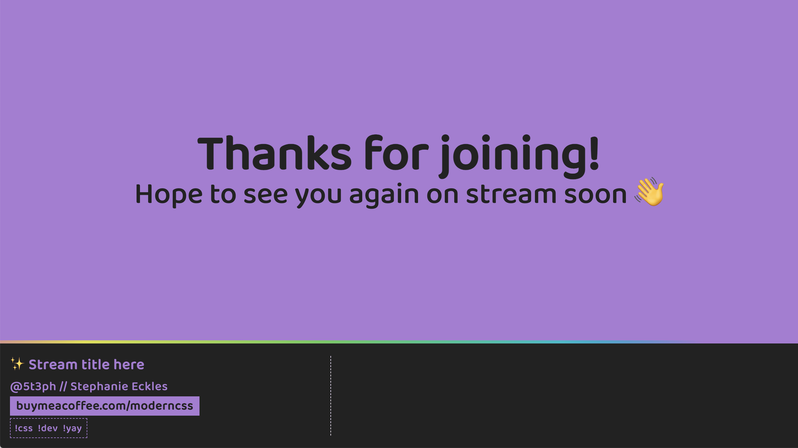

# Twitch Scenes

> This setup is created using Eleventy and Sass, and each scene is available from `http://localhost:8090/[scene-name]`

_If you're new to streaming (I was!) check out [this Learn With Jason episode](https://www.learnwithjason.dev/about-streaming) where Jason does Q&A about his stream setup._

## Initial Stream Setup

Customize the stream title, description, and CTA within `/src/_data/stream.js`.

**Run `npm start` to launch the scenes** at `http://localhost:8090/` (or customize the port within the package `watch:eleventy` script).

## Scene Anatomy

A scene specific class is generated as `scene-[fileslug]` on the `<main>` element.

The `index` maps to the `primary` Sass file, the other `/scenes/` map to the Sass file matching the file slug. If you add a scene, you will need to create a class to apply styles to `<main>` unless you want the entire area to be a capture area.

The `preshow` layout is an example of passing content to be included within `<main>`.

### Scene Styles

The styles use gradients to leave "transparent" areas for extra stream scene elements such as video capture, display capture, and window capture elements to show through.

The basic colors are passed in from CSS custom properties defined in `_layout.scss`.

> Please update the colors, particularly of the gradient border on the `header`, as the ones in this starter are unique to the [ModernCSS.dev](https://moderncss.dev) branding

### Capture Areas

In the `primary` scene, the main stream area is approximately 1028x550 when streaming at 1280x720 (and if your text content doesn't increase the height of the header area).

In the `host` scene, the center of the radial gradient is the capture area.

For both of those scenes, there is an additional area intended for captions next to the title bar that will vary depending on your title/description/cta widths.

> Try out [WebCaptioner](https://webcaptioner.com/) as a window source for stream captions. Optimal viewport size to best fit the capture area is 1792 (the width of a 15" Mac laptop) by 380px inner viewport height (tip: open DevTools to help size the viewport area)

## Scene Previews

**preshow**

**primary**

**host**

**postshow**

