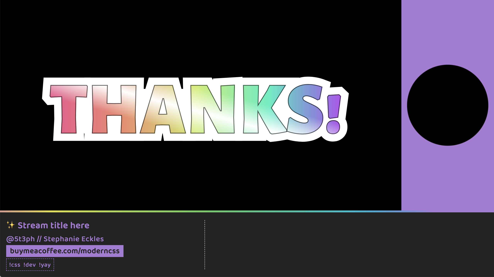
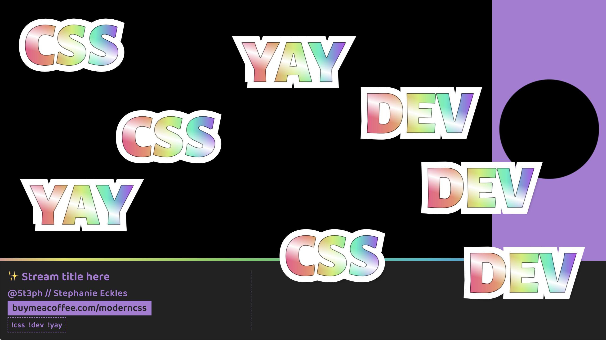

# Twitch Scenes

> This setup is created using Eleventy and Sass, and each scene is available from `http://localhost:8090/[scene-name]`

_If you're new to streaming (I was!) check out [this Learn With Jason episode](https://www.learnwithjason.dev/about-streaming) where Jason does Q&A about his stream setup._

## Initial Stream Setup

Customize the stream meta data including allowed chat commands within `/src/_data/stream.js`.

**Run `npm start` to launch the scenes** at `http://localhost:8090/` (or customize the port within the package `watch:eleventy` script).

## Scene Anatomy

A scene specific class is generated as `scene-[fileslug]` on the `<main>` element.

The `index` maps to the `primary` Sass file, the other `/scenes/` map to the Sass file matching the file slug. If you add a scene, you will need to add a CSS style to it's new class to apply styles to `<main>` unless you want the entire area to be a capture area.

The `preshow` layout is an example of passing content to be included within `<main>`.

### Scene Styles

The styles use gradients to leave "transparent" areas for extra stream scene elements such as video capture, display capture, and window capture elements to show through.

The basic colors are passed in from CSS custom properties defined in `_layout.scss`.

> Please update the colors, particularly of the gradient border on the `header`, as the ones in this starter are unique to the [ModernCSS.dev](https://moderncss.dev) branding

### Extra Resource: Slideshow

Not an official scene, but a template you can use if you want to create a simple slideshow presentation as part of your stream.

Uses the [CSS feature of scroll snapping](https://smolcss.dev/#smol-scroll-snap) to create a full-screen slideshow.

To use, visit `http://localhost:8090/slideshow` and use horizontal scrolling. You will need to use display capture instead of browser capture so that you can manipulate the screen.

### Capture Areas

In the `primary` scene, the main stream capture area is approximately 1030x550 when streaming at 1280x720 (and if your text content doesn't increase the height of the header area).

In the `host` scene, the center of the radial gradient is the capture area.

For both of those scenes, there is an additional area intended for captions next to the title bar that will vary depending on your title/description/cta widths.

> Try out [WebCaptioner](https://webcaptioner.com/) as a window source for stream captions. Optimal viewport size to best fit the capture area is 1792 (the width of a 15" Mac laptop) by 380px inner viewport height (tip: open DevTools to help size the viewport area)

## Command Reponses

Scripts and styles are included to handle chat commands and new subscriptions. These are received with the help of [ComfyJS](https://github.com/instafluff/ComfyJS).

You must provide your `twitchUsername` within `/src/_data/stream.js` and at least one `chatCommand` for this to work.

To modify behavior:

- edit `_includes/comfy/commands.js` to alter the ComfyJS scripts
- edit `sass/_commands.scss` to modify the appearance of command words

Command words are given a gradient "sticker" style, and will be positioned randomly across the `main` area of the screen. They will come in with a zoom transition and then zoom back out of view after one second.

If you keep the provided style, it's best to keep command words under 5 characters for the best effect.

> Catch the last scene preview to see how the scene would look if chat mobbed the available commands

#### Test Chat Commands

Visit `https://www.twitch.tv/popout/[TWITCH USERNAME]/chat?popout=` and enter your chat command - example: `!css` - to test the display.

### Edit Chat Commands

If you want to enable chat commands, add those within the `stream.js`. Each command will be automatically listed below the CTA in the `header`.

### New Subscription "Thanks!"

In the same style of the commands but larger, a `THANKS!` message will zoom in when you receive a new subscription, and zoom back out like the commands. _Scene preview available below_.

## Scene Previews

**preshow**

**primary**

**host**

**postshow**

**new subscription reaction**

**command demo**

